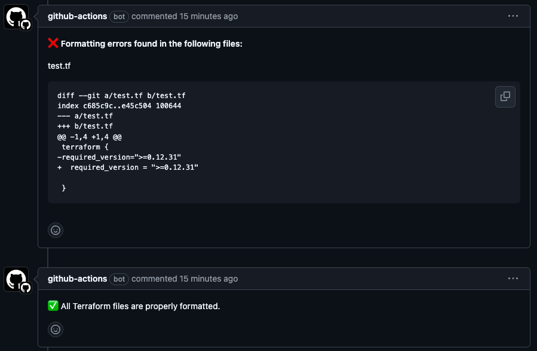

# Enforce Terraform Format (`terraform fmt`)

A GitHub Action that enforces Terraform formatting standards by running `terraform fmt` on all committed files. The workflow will fail if any files require reformatting.

## Features

* Automatically checks Terraform file formatting on each pull request.
* Posts detailed comments on pull requests highlighting formatting issues when the `GITHUB_TOKEN` is provided.
* Ensures consistency across Terraform codebases.

## Permissions Scopes

The following permissions scopes are needed:

| Permission      | Level   | Description                                               |
|-----------------|---------|-----------------------------------------------------------|
| `contents`      | `read`  | Work with the contents of the repository and list commits |
| `pull-requests` | `write` | Add comments to the Pull Request                          |

## Pull Request Comments

When the `GITHUB_TOKEN` is passed, the action posts a comment to the pull request. The comment includes:

* A list of files that require formatting.
* The specific differences introduced by running `terraform fmt`.

Example comment:


## Determining Changed Files

To accurately determine changed files, set the `fetch-depth` in the checkout step:

* **Recommended**: Use `fetch-depth: 0` to fetch the full commit history.
* **Minimum Requirement**: Set `fetch-depth` to at least `3`.

If changed files cannot be identified (e.g., shallow fetch), the action will default to checking all Terraform files, including unchanged files.

## Inputs

| Name                | Description                     | Required | Default |
|---------------------|---------------------------------|----------|---------|
| `terraform_version` | The version of Terraform to use | Yes      | None    |

## Example usage

```yaml
name: Enforce Terraform Format
on:
  pull_request:
    paths:
      - '**/*.tf'
      - '**/*.tfvars'

jobs:
  terraform-fmt:
    runs-on: ubuntu-latest
    permissions:
      contents: read
      pull-requests: write
    steps:
      - name: Checkout the contents
        uses: actions/checkout@v4
        with:
          fetch-depth: '0' # Fetch full history for accurate file change detection

      - name: Enforce Terraform formatting
        uses: pvicol/enforce-terraform-fmt@v1.2.0
        with:
          terraform_version: '1.9.8'
        env:
          GITHUB_TOKEN: ${{ secrets.GITHUB_TOKEN }}

```
